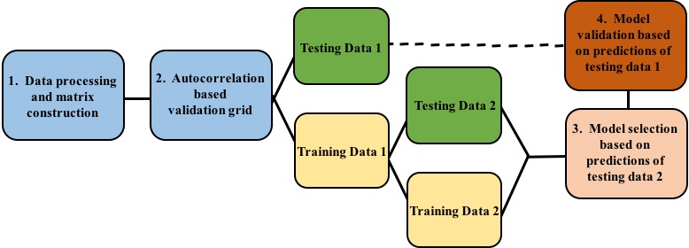
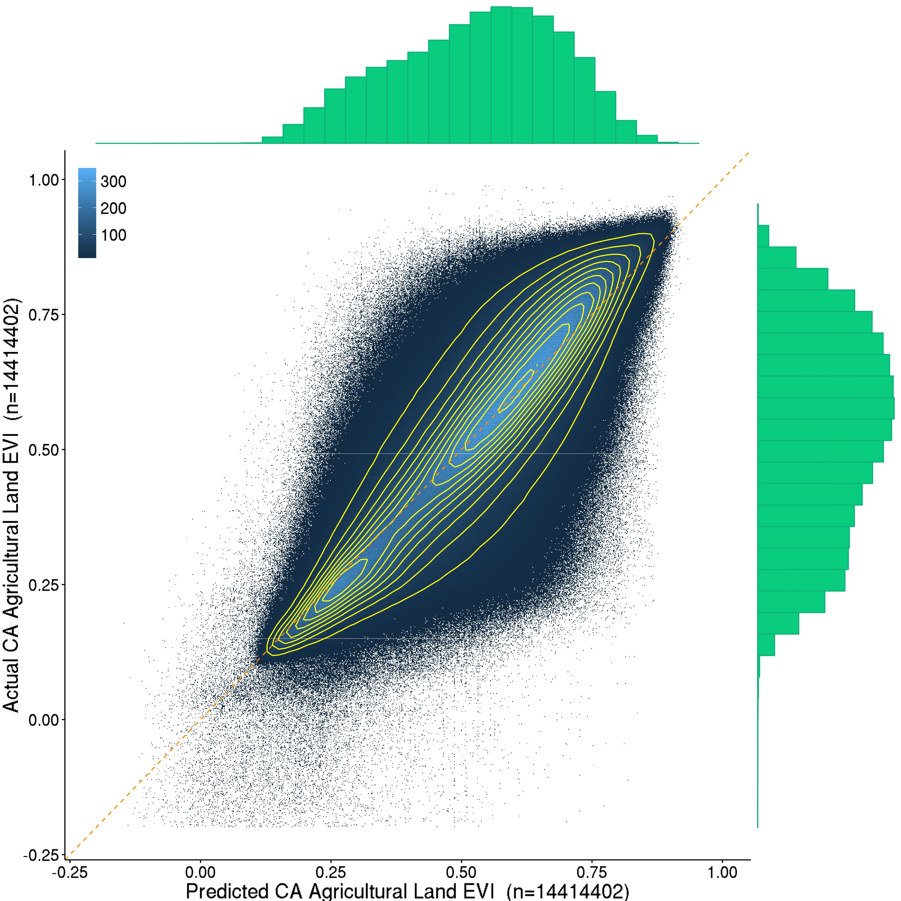

---
output:
  md_document:
    variant: markdown_github
---

<!-- README.md is generated from README.Rmd. Please edit that file -->

# Forecasting Vegetation Health at High Spatial Resolution

Drought threatens food and water security around the world, and this threat is likely to become more severe under climate change.  High resolution predictive information can help farmers, water managers, and others to manage the effects of drought.  We have created a tool to produce short-term forecasts of vegetation health at high spatial resolution, using open source software and [NASA satellite data](http://modis.gsfc.nasa.gov/data/dataprod/index.php) that are global in coverage.  The tool automates downloading and processing Moderate Resolution Imaging Spectroradiometer (MODIS) datasets, and training gradient-boosted machine models on hundreds of millions of observations to predict future values of the Enhanced Vegetation Index.  We compared the predictive power of different sets of variables (raw spectral MODIS data and Level-3 MODIS products) in two regions with distinct agro-ecological systems, climates, and cloud coverage:  Sri Lanka and California.  Our tool provides considerably greater predictive power on held-out datasets than simpler baseline models.

This website hosts the supplementary material for this project by [John J. Nay](http://johnjnay.com/), [Emily Burchfield](https://ekburchfield.wordpress.com/), and [Jonathan Gilligan](https://my.vanderbilt.edu/jonathangilligan), listing the external software requirements and the exact commands to be run in a terminal for completing our process.

The data downloading and processing requires a computer with significant amounts of RAM (> 100 GB) because the data must be held in memory to manipulate it. The modeling and hyper-parameters search can be run on weaker machines but the training time will take months if run on a laptop. To complete model training and hyper-parameters search in a few days, train the models on a computer with >= available 32 threads and >= 100 GB RAM.

If you use these scripts, cite this paper:

Nay, John J., Burchfield, Emily, Gilligan, Jonathan. (2016) "Forecasting Vegetation Health at High Spatial Resolution." eprint arXiv:1602.06335

The paper can be downloaded as a pdf here: [http://arxiv.org/abs/1602.06335](http://arxiv.org/abs/1602.06335).

United States National Science Foundation grant EAR-1204685 funded this research.


# Overview:

The figure below illustrates our process. We downloaded and processed eleven years of remotely sensed imagery. We combined this data with ancillary datasets and reshaped it into a single matrix where each row corresponds to a pixel at one time and each column is a measured variable.  We divided the observations into Training Data 1 and Testing Data 1 by sampling from large spatial grid indices without replacement. We then divided Training Data 1 into Training Data 2 and Testing Data 2 with the same spatial sampling process, and trained multiple models on Training Data 2, varying the hyper-parameters for each model estimation.  We used Testing Data 2 to assess the performance of each model’s predictions.  We repeated this loop of learning on Training Data 2 and testing on Testing Data 2 for each of the four different data types, and chose the combination of data type and hyper-parameter setting that achieved the highest performance in predicting Testing Data 2.  Finally, we validated the best-performing model from the previous step by testing its performance on the held-out data in Testing Data 1. We repeated this entire process separately for Sri Lanka and California.



The next figure displays predictions of agricultural land in Testing Data 1, the hold-out data, in California.



# Requirements

* Python 2.7 https://www.python.org/download/releases/2.7/
* h2o 3 http://www.h2o.ai/download/h2o/python

```
[sudo] pip install requests # for h2o
[sudo] pip install tabulate # for h2o
[sudo] pip install numpy # for reshaping and saving data
[sudo] pip install pandas # for reshaping and saving data
[sudo] pip install hyperopt # for estimating hyper-parameters of h2o models
[sudo] pip install annoy # for baseline model
```

The optional visualizations of validation performance requires R, and the R packages dplyr, ggplot2, and ggExtra.

# Data construction:

python -u 0_matrix_construction.py spectral directory username password tiles today enddate referenceImage > 0_construct.log &

  * python -u 0_matrix_construction.py 1 /data/emily/SL myusername mypassword 'h25v08 h26v08' 2014-01-30 2014-01-01 /data/emily/WF/NDVI_DC/SL.tif

# Pre-processing (spectral and non-spectral use different scripts):

### For non-spectral:
 
python -u 1_pre_process.py *load_data_fp save_data_fp load_extra_file intervals* > 1_process.log &

  * load_extra_file is optional, its used when an analyst has ancillary data, e.g. land-use classifications
  * python -u 1_pre_process.py /data/emily/SL/ /data/john/srilanka/data1.csv /data/NDVI/columns/landuse.npy 253 > 1_process.log &
  * python -u 1_pre_process.py /data/emily/CA/ /data/john/CA/data1.csv /data/emily/SJ/SJlanduse.npy 253 > 1_processCA.log &

### For spectral:

python -u 1_pre_processS.py *load_data_fp save_data_fp old_data_fp intervals load_extra_file* > 1_processS.log &

  * python -u 1_pre_processS.py /data/emily/SLs/ /data/john/srilanka/data1S.csv /data/john/srilanka/data1.csv 253 /data/NDVI/columns/landuse.npy > 1_processS.log &
    * python -u 1_pre_processS.py /data/emily/CAs/ /data/john/CA/data1S.csv /data/john/CA/data1.csv 253 /data/emily/SJ/SJlanduse.npy > 1_processSCA.log &
    
  * python -u 1_pre_processS.py /data/emily/BL/spectral/ /data/john/BL/data1S.csv None 230 > 1_processSBL.log &

## For h2o:

### For non-spectral:

python -u 2_h2o_process.py *load_data_fp save_data_fp* > 2a_h2o.log &

  * python -u 2_h2o_process.py /data/john/srilanka/data1.csv /data/john/srilanka/h2o_data_withMissing > 2a_h2o.log &
  * python -u 2_h2o_process.py /data/john/CA/data1.csv /data/john/CA/h2o_data_withMissing > 2a_h2oCA.log &

python -u 2_h2o_process_2.py *load_data_fp save_training_data_fp save_holdout_data_fp save_training_ind_fp* > 2b_h2o.log &

*save_training_ind_fp* is an optional argument for the 2_h2o_process_2.py script. If it is provided, then the script will create a column indicating whether each row is in the training or testing data. This column will be used by subsequent scripts in dividing data into training and testing (not hold-out data, that was done previously). When we run the spectral we usually do not specify this argument because we don't want to overwite the file we created for the level-3 data: this allows us to use the same training/test split and compare performance across predictor variable data type.

  * python -u 2_h2o_process_2.py /data/john/srilanka/h2o_data_withMissing /data/john/srilanka/h2o_data_training /data/john/srilanka/h2o_data_holdout /data/john/srilanka/random_split_for_training.csv > 2b_h2o.log &
  * python -u 2_h2o_process_2.py /data/john/CA/h2o_data_withMissing /data/john/CA/h2o_data_training /data/john/CA/h2o_data_holdout /data/john/CA/random_split_for_training.csv > 2b_h2oCA.log &

### For spectral:

python -u 2_h2o_processS.py *load_data_fp save_data_fp* > 2a_h2oS.log &

  * python -u 2_h2o_processS.py /data/john/srilanka/data1S.csv /data/john/srilanka/h2o_data_withMissingS > 2a_h2oS.log &
  * python -u 2_h2o_processS.py /data/john/CA/data1S.csv /data/john/CA/h2o_data_withMissingS > 2a_h2oSCA.log &
  
  * python -u 2_h2o_processS.py /data/john/BL/data1S.csv /data/john/BL/h2o_data_withMissingS > 2a_h2oSBL.log &

python -u 2_h2o_process_2.py *load_data_fp save_training_data_fp save_holdout_data_fp* > 2b_h2oS.log &

  * Starting here, all the scripts are the same for spectral and non spectral. You just pass them different arguments.
  * If you run non-spectral first, you can optionally not specify the *save_training_ind_fp* with 2_h2o_process_2.py and thus not over-wrtie the csv file with the vector of indices denoting a training and testing data split. This allows results to be comparable between spectral and non-spectral.
  * python -u 2_h2o_process_2.py /data/john/srilanka/h2o_data_withMissingS /data/john/srilanka/h2o_data_trainingS /data/john/srilanka/h2o_data_holdoutS > 2b_h2oS.log &
  * python -u 2_h2o_process_2.py /data/john/CA/h2o_data_withMissingS /data/john/CA/h2o_data_trainingS /data/john/CA/h2o_data_holdoutS > 2b_h2oSCA.log &
  
    * python -u 2_h2o_process_2.py /data/john/BL/h2o_data_withMissingS /data/john/BL/h2o_data_trainingS /data/john/BL/h2o_data_holdoutS /data/john/BL/random_split_for_training.csv > 2b_h2oSBL.log &

## For baseline:

python -u 2_baseline_process.py load_data_fp save_data_fp > 2_baseline.log &

  * python -u 2_baseline_process.py /data/john/srilanka/data1.csv /data/john/srilanka/baseline_data.csv > 2_baseline.log &
  * python -u 2_baseline_process.py /data/john/CA/data1.csv /data/john/CA/baseline_data.csv > 2_baselineCA.log &
  * python -u 2_baseline_process.py /data/john/BL/data1S.csv /data/john/BL/baseline_data.csv > 2_baselineBL.log &
  
# Modeling (spectral and non-spectral use same scripts, just different arguments for predictor variables)

# Modeling in h2o with GBM:

## For non-spectral:

python -u 3_h2o_gbm.py *load_data_fp* *load_train_ind_fp* *saving_fp* GWP_lag LST_lag NDVI_lag FPAR_lag LAI_lag GP_lag PSN_lag nino34_lag time_period EVI_lag landuse > 3_gbm.log &

  * python -u 3_h2o_gbm.py /data/john/srilanka/h2o_data_training /data/john/srilanka/random_split_for_training.csv output/gbmres.csv GWP_lag LST_lag NDVI_lag FPAR_lag LAI_lag GP_lag PSN_lag nino34_lag time_period EVI_lag landuse > 3_gbm.log &
    * python -u 3_h2o_gbm.py /data/john/srilanka/h2o_data_training /data/john/srilanka/random_split_for_training.csv output/gbmres_evi.csv EVI_lag > 3_gbmevi.log &
    * python -u 3_h2o_gbm.py /data/john/srilanka/h2o_data_training /data/john/srilanka/random_split_for_training.csv output/gbmres_evilt.csv time_period EVI_lag landuse > 3_gbmevilt.log &
  * python -u 3_h2o_gbm.py /data/john/CA/h2o_data_training /data/john/CA/random_split_for_training.csv output/gbmresCA.csv GWP_lag LST_lag NDVI_lag FPAR_lag LAI_lag GP_lag PSN_lag nino34_lag time_period EVI_lag landuse > 3_gbmCA.log &
    * python -u 3_h2o_gbm.py /data/john/CA/h2o_data_training /data/john/CA/random_split_for_training.csv output/gbmresCA_evi.csv EVI_lag > 3_gbmCAevi.log &
    * python -u 3_h2o_gbm.py /data/john/CA/h2o_data_training /data/john/CA/random_split_for_training.csv output/gbmresCA_evilt.csv time_period EVI_lag landuse > 3_gbmCAevilt.log &

## For spectral:

python -u 3_h2o_gbm.py *load_data_fp* *load_train_ind_fp* *saving_fp* B1_lag B2_lag B3_lag B4_lag B5_lag B6_lag B7_lag GWP_lag nino34_lag time_period EVI_lag landuse > 3_gbm.log &

  * python -u 3_h2o_gbm.py /data/john/srilanka/h2o_data_trainingS /data/john/srilanka/random_split_for_training.csv output/gbmresS.csv B1_lag B2_lag B3_lag B4_lag B5_lag B6_lag B7_lag GWP_lag nino34_lag time_period EVI_lag landuse > 3_gbm.log &
  * python -u 3_h2o_gbm.py /data/john/CA/h2o_data_trainingS /data/john/CA/random_split_for_training.csv output/gbmresSCA.csv B1_lag B2_lag B3_lag B4_lag B5_lag B6_lag B7_lag GWP_lag nino34_lag time_period EVI_lag landuse > 3_gbmCA.log &
  
  * python -u 3_h2o_gbm.py /data/john/BL/h2o_data_trainingS /data/john/BL/random_split_for_training.csv gbmresSBL.csv B1_lag B2_lag B3_lag B4_lag B5_lag B6_lag B7_lag GWP_lag nino34_lag time_period EVI_lag landuse > 3_gbmBL.log &


# Modeling in h2o with deep learning (both model-imputed and mean-imputed):

## For non-spectral:

python -u 3_h2o_deeplearning_imputation.py *load_data_fp saving_meanImputed_fp saving_modelImputed_fp saving_means_fp saving_models_fp* GWP_lag LST_lag NDVI_lag FPAR_lag LAI_lag GP_lag PSN_lag nino34_lag time_period EVI_lag landuse > 3_dl_imp.log &

  * python -u 3_h2o_deeplearning_imputation.py /data/john/srilanka/h2o_data_training /data/john/srilanka/mean_imputed_data /data/john/srilanka/model_imputed_data /data/john/srilanka/dl_imputation_means.csv /data/john/srilanka/models/ GWP_lag LST_lag NDVI_lag FPAR_lag LAI_lag GP_lag PSN_lag nino34_lag time_period EVI_lag landuse > 3_dl_imp.log &
    * python -u 3_h2o_deeplearning_imputation.py /data/john/CA/h2o_data_training /data/john/CA/mean_imputed_data /data/john/CA/model_imputed_data /data/john/CA/dl_imputation_means.csv /data/john/CA/models/ GWP_lag LST_lag NDVI_lag FPAR_lag LAI_lag GP_lag PSN_lag nino34_lag time_period EVI_lag landuse > 3_dl_impCA.log &

python -u 3_h2o_deeplearning.py *load_data_fp load_train_ind_fp saving_fp* GWP_lag LST_lag NDVI_lag FPAR_lag LAI_lag GP_lag PSN_lag nino34_lag time_period EVI_lag landuse > 3_dl_mean.log &

  * python -u 3_h2o_deeplearning.py /data/john/srilanka/mean_imputed_data /data/john/srilanka/random_split_for_training.csv output/dlres_meanimputed.csv GWP_lag LST_lag NDVI_lag FPAR_lag LAI_lag GP_lag PSN_lag nino34_lag time_period EVI_lag landuse > 3_dl_mean.log &
    * python -u 3_h2o_deeplearning.py /data/john/CA/mean_imputed_data /data/john/CA/random_split_for_training.csv output/dlres_meanimputedCA.csv GWP_lag LST_lag NDVI_lag FPAR_lag LAI_lag GP_lag PSN_lag nino34_lag time_period EVI_lag landuse > 3_dl_meanCA.log &

  * python -u 3_h2o_deeplearning.py /data/john/srilanka/model_imputed_data /data/john/srilanka/random_split_for_training.csv output/dlres_modelimputed.csv GWP_lag LST_lag NDVI_lag FPAR_lag LAI_lag GP_lag PSN_lag nino34_lag time_period EVI_lag landuse > 3_dl_model.log &
    * python -u 3_h2o_deeplearning.py /data/john/CA/model_imputed_data /data/john/CA/random_split_for_training.csv output/dlres_modelimputedCA.csv GWP_lag LST_lag NDVI_lag FPAR_lag LAI_lag GP_lag PSN_lag nino34_lag time_period EVI_lag landuse > 3_dl_modelCA.log &

## For spectral:

python -u 3_h2o_deeplearning_imputation.py *load_data_fp saving_meanImputed_fp saving_modelImputed_fp saving_means_fp saving_models_fp* B1_lag B2_lag B3_lag B4_lag B5_lag B6_lag B7_lag GWP_lag nino34_lag time_period EVI_lag landuse > 3_dl_imp.log &

  * python -u 3_h2o_deeplearning_imputation.py /data/john/srilanka/h2o_data_trainingS /data/john/srilanka/mean_imputed_dataS /data/john/srilanka/model_imputed_dataS /data/john/srilanka/dl_imputation_meansS.csv /data/john/srilanka/modelsS/ B1_lag B2_lag B3_lag B4_lag B5_lag B6_lag B7_lag GWP_lag nino34_lag time_period EVI_lag landuse > 3_dl_impS.log &
    * python -u 3_h2o_deeplearning_imputation.py /data/john/CA/h2o_data_trainingS /data/john/CA/mean_imputed_dataS /data/john/CA/model_imputed_dataS /data/john/CA/dl_imputation_meansS.csv /data/john/CA/modelsS/ B1_lag B2_lag B3_lag B4_lag B5_lag B6_lag B7_lag GWP_lag nino34_lag time_period EVI_lag landuse > 3_dl_impSCA.log &
  
python -u 3_h2o_deeplearning.py *load_data_fp load_train_ind_fp saving_fp* B1_lag B2_lag B3_lag B4_lag B5_lag B6_lag B7_lag GWP_lag nino34_lag time_period EVI_lag landuse > 3_dl_meanS.log &

  * python -u 3_h2o_deeplearning.py /data/john/srilanka/mean_imputed_dataS /data/john/srilanka/random_split_for_training.csv output/dlres_meanimputedS.csv B1_lag B2_lag B3_lag B4_lag B5_lag B6_lag B7_lag GWP_lag nino34_lag time_period EVI_lag landuse > 3_dl_meanS.log &
    * python -u 3_h2o_deeplearning.py /data/john/CA/mean_imputed_dataS /data/john/CA/random_split_for_training.csv output/dlres_meanimputedSCA.csv B1_lag B2_lag B3_lag B4_lag B5_lag B6_lag B7_lag GWP_lag nino34_lag time_period EVI_lag landuse > 3_dl_meanSCA.log &

  * python -u 3_h2o_deeplearning.py /data/john/srilanka/model_imputed_dataS /data/john/srilanka/random_split_for_training.csv output/dlres_modelimputedS.csv B1_lag B2_lag B3_lag B4_lag B5_lag B6_lag B7_lag GWP_lag nino34_lag time_period EVI_lag landuse > 3_dl_modelS.log &
    * python -u 3_h2o_deeplearning.py /data/john/CA/model_imputed_dataS /data/john/CA/random_split_for_training.csv output/dlres_modelimputedSCA.csv B1_lag B2_lag B3_lag B4_lag B5_lag B6_lag B7_lag GWP_lag nino34_lag time_period EVI_lag landuse > 3_dl_modelSCA.log &

# Predicting holdout:

This data is reserved for final testing of the best model.

Only run the spectral or the level 3 (non-spectral) on the hold out data, not both. Choose the one that did the best on the test data in the previous scripts. Only run the deep learning or the GBM, not both. Choose the one that did the best on the test data in the previous scripts.

## With Baseline:

python -u 4_baseline.py *load_data_fp saving_model saving_fp saving_predictions_fp Trees Neighbs K* > 4_bline_holdout.log &

  * python -u 4_baseline.py /data/john/srilanka/baseline_data.csv /data/john/srilanka/baseline_model.ann output/baseline_holdout.csv  /data/john/srilanka/baseline_predicted_holdout.csv 7 30 10 > 4_bline_holdout.log &
  * python -u 4_baseline.py /data/john/CA/baseline_data.csv /data/john/CA/baseline_model.ann output/baseline_holdout.csv  /data/john/CA/baseline_predicted_holdout.csv 7 30 10 > 4_bline_holdoutCA.log &
  * python -u 4_baseline.py /data/john/BL/baseline_data.csv /data/john/BL/baseline_model.ann baseline_holdout.csv  /data/john/BL/baseline_predicted_holdout.csv 7 30 10 > 4_bline_holdoutBL.log &
  
## With Models:

python -u 4_holdout_models.py *load_data_fp train_data_fp training_res_fp saving_fp saving_predictions_fp saving_varimp_fp predictors* > 4_model_holdout.log &

### For non-spectral and GBM:

  * python -u 4_holdout_models.py /data/john/srilanka/h2o_data_holdout /data/john/srilanka/h2o_data_training output/gbmres.csv output/gbm_holdout_final.csv /data/john/srilanka/gbm_predicted_holdout.csv output/gbm_varimp.csv GWP_lag LST_lag NDVI_lag FPAR_lag LAI_lag GP_lag PSN_lag nino34_lag time_period EVI_lag landuse > 4_model_holdout.log &
    * python -u 4_holdout_models.py /data/john/CA/h2o_data_holdout /data/john/CA/h2o_data_training output/gbmresCA.csv output/gbm_holdout_finalCA.csv /data/john/CA/gbm_predicted_holdout.csv output/gbm_varimpCA.csv GWP_lag LST_lag NDVI_lag FPAR_lag LAI_lag GP_lag PSN_lag nino34_lag time_period EVI_lag landuse > 4_model_holdoutCA.log &
  
### For spectral and GBM:

  * python -u 4_holdout_models.py /data/john/srilanka/h2o_data_holdoutS /data/john/srilanka/h2o_data_trainingS output/gbmresS.csv output/gbm_holdout_finalS.csv /data/john/srilanka/gbm_predicted_holdoutS.csv output/gbm_varimp.csv B1_lag B2_lag B3_lag B4_lag B5_lag B6_lag B7_lag GWP_lag nino34_lag time_period EVI_lag landuse > 4_model_holdoutS.log &
    * python -u 4_holdout_models.py /data/john/CA/h2o_data_holdoutS /data/john/CA/h2o_data_trainingS output/gbmresSCA.csv output/gbm_holdout_finalSCA.csv /data/john/CA/gbm_predicted_holdoutS.csv output/gbm_varimpCA.csv B1_lag B2_lag B3_lag B4_lag B5_lag B6_lag B7_lag GWP_lag nino34_lag time_period EVI_lag landuse > 4_model_holdoutSCA.log &
    * python -u 4_holdout_models.py /data/john/BL/h2o_data_holdoutS /data/john/BL/h2o_data_trainingS gbmresSBL.csv gbm_holdout_finalSBL.csv /data/john/BL/gbm_predicted_holdoutS.csv gbm_varimpBL.csv B1_lag B2_lag B3_lag B4_lag B5_lag B6_lag B7_lag GWP_lag nino34_lag time_period EVI_lag landuse > 4_model_holdoutSBL.log &

# Create plots of validation performance:

For model selection, the plot comparing the performance of the different data types and locations:

```
Rscript paper_plots_modelSelection.R &
```

For final model validation on hold-out data, the many plots illustrating performance over space and time:

```
Rscript paper_plots.R &
```
